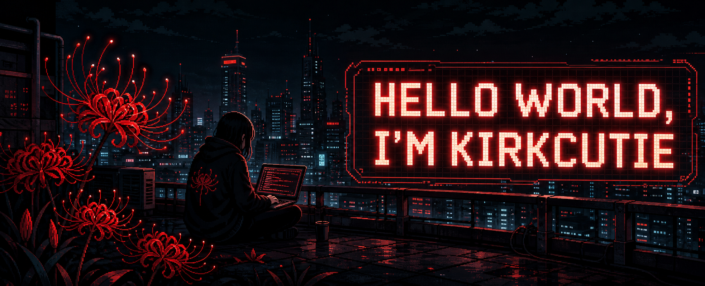

<div align="center">



<br>


</div>

---

## whoami

```bash
$ whoami
kirkcutie

$ focus
penetration testing | web security | recon | practical labs
```

I am building my path around penetration testing, web application security, and offensive security fundamentals. I like learning how systems behave, finding weak points safely, and turning every test into clearer notes and cleaner reports.

## Current Focus

- Web application penetration testing
- Reconnaissance and information gathering
- OWASP Top 10 practice
- Authentication and session testing
- API security testing
- Burp Suite workflows
- Linux and networking fundamentals
- Capture the Flag labs
- Responsible disclosure mindset

## Toolkit

<div align="center">


</div>

## Lab Progress

```text
Recon             [#########..] building better methodology
Web Testing       [########...] practicing OWASP findings
Scripting         [#######....] automating small tasks
Reporting         [######.....] writing cleaner impact notes
CTF / Labs        [########...] sharpening pattern recognition
```

## Red Spider Lily Mode

```text
        @@@        @@@
      @@   @@    @@   @@
        @@   @@@@   @@
          @@  ||  @@
     @@@@@@@  ||  @@@@@@@
          @@  ||  @@
        @@   ||||   @@
      @@   @@    @@   @@
        @@@        @@@
```

## Projects

- Security practice notes and lab writeups
- Web experiments and portfolio builds
- Small scripts for learning and automation
- More pentesting-focused tools coming soon

## Rules I Keep

- Test only where authorized
- Understand before exploiting
- Document steps clearly
- Report real impact
- Keep learning daily

---

<div align="center">

```text
pixel red spider lily // quiet recon // clean reports
```

</div>
