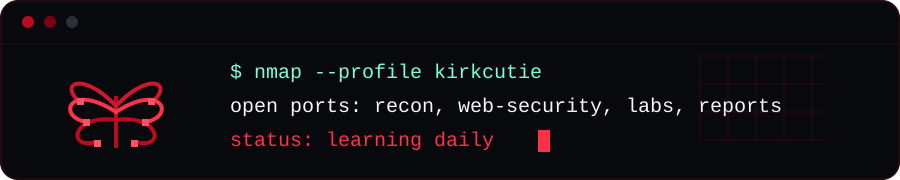

<div align="center">


<br>
<br>



<br>


</div>

---

## whoami

```bash
$ ./whoami.sh
name      : kirkcutie
focus     : penetration testing / web security
mindset   : test only where authorized
```

I am building my path around penetration testing, web application security, and offensive security fundamentals. I like learning how systems behave, finding weak points safely, and turning every test into clearer notes and cleaner reports.

## Current Focus

- Web application penetration testing
- Reconnaissance and information gathering
- OWASP Top 10 practice
- Authentication and session testing
- API security testing
- Burp Suite workflows
- Linux and networking fundamentals
- Capture the Flag labs
- Responsible disclosure mindset

## Toolkit

<div align="center">


</div>

## Lab Progress

| Track | Progress | Current Goal |
| --- | --- | --- |
| Recon |  | Build cleaner target maps |
| Web Testing |  | Practice OWASP findings |
| Scripting |  | Automate small tasks |
| Reporting |  | Write clearer impact notes |
| CTF / Labs |  | Sharpen methodology |

## Projects

- Security practice notes and lab writeups
- Web experiments and portfolio builds
- Small scripts for learning and automation
- More pentesting-focused tools coming soon

## Rules I Keep

- Test only where authorized
- Understand before exploiting
- Document steps clearly
- Report real impact
- Keep learning daily
